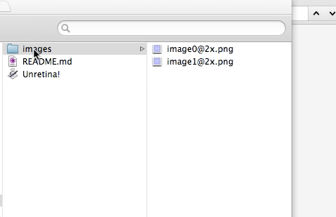
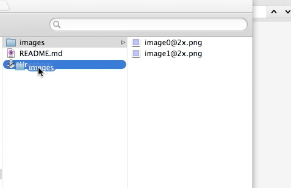
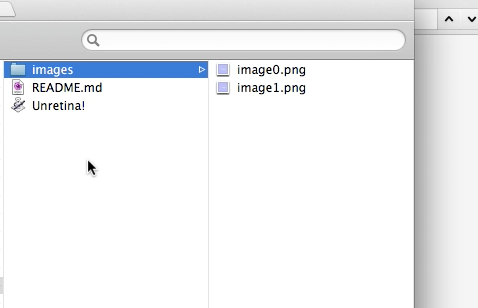

# Unretina!
Mac OS X automation app for converting retina image to non retina image.  
This is destructive operation. Please backup your image files before execute the operation.

## Usage
### Step 1
Drag a images folder.

</img>

### Step 2
Drop a images folder to Unretina!.app.

</img>

### Step 3
Done.

</img>

